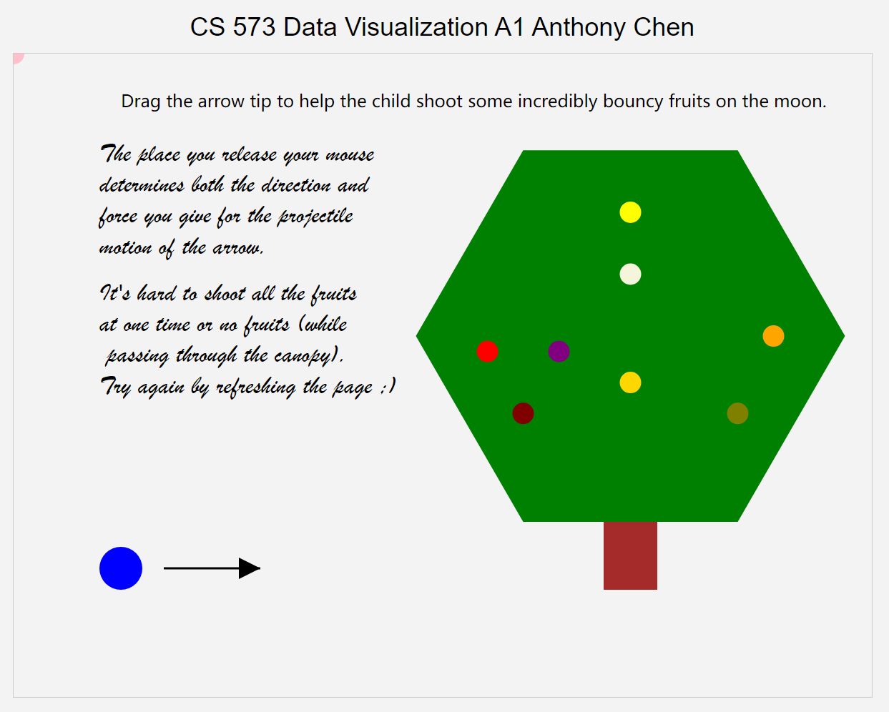

Assignment 1 - Hello World: GitHub and d3  

Description:
For this project I created a house with triangles, rectangles, circles and lines, as requested. I've read the document of d3,https://d3js.org/. And I've found the way to create the house. I also insert image in this house and simulate the effect of glass reflections.

Link to gh-pages:https://SkyStriker0164.github.io/a1-ghd3/index.html

Screenshot

Technical Achievement 
To create a polygon, which can be various shape. It defined by a set of vertices so I need provide the coordinates of these vertices. And I want to insert image in this polygon, in SVG, we can insert images by using '<image>' tag and specifying the 'href' attribute to the desired URL. But SVG doesn't support the inserting image into polygon. So I use clipping paths to shape the image.

As a newbie using d3 for the first time, I don't know how to measure the precise location between these elements in the canvas. To solve this problem in a more efficient way, I learned at https://www.zhihu.com/question/590842536 for reference.

