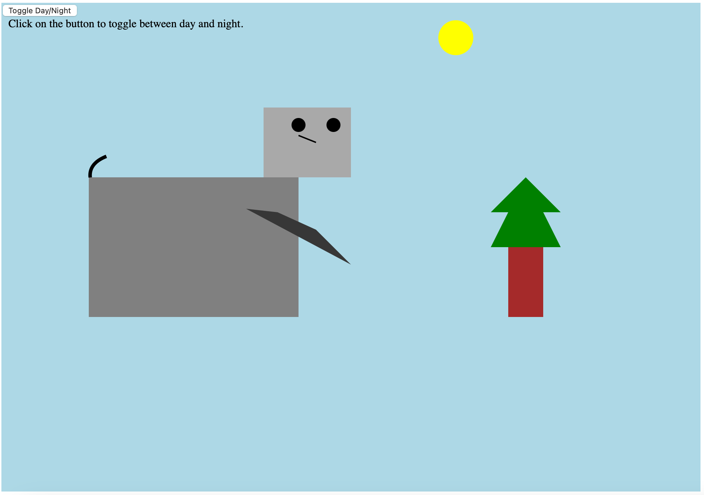
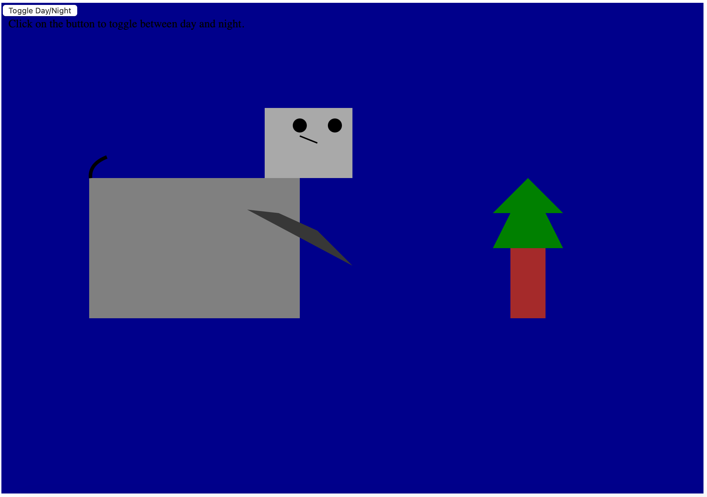

Abigail Albuquerque - Assignment 1
---
For assignment 1, I have created a visual of a square cat, sitting next to a tree in the sun. Additionally, I have created a button that can toggle between day and night. During the "night", the sun disappears and the light blue background during the day turns to dark blue.

Here is a link to the 'live' url:

Screenshots of the project:

Technical achievements:
--
The major technical achievement for me in this project was learning the basics of D3. Outside of the basic technical elements of the project like learning how to use github pages, I also created an interactive element in the program. The interactive element includes a button that can toggle the picture between day and night.

Design achievements:
--
In this project, I have achieved the basic design achievements of using shapes like rectangles, lines, squares, circles and polygons. Additionally I have also used "path" to create inordinary shapes like curved lines, as can be seen with the cats tail.

References:
https://stackoverflow.com/questions/20644415/d3-appending-text-to-a-svg-rectangle

https://stackoverflow.com/questions/13204562/proper-format-for-drawing-polygon-data-in-d3

https://d3js.org/getting-started

Additionally, I used the help of ChatGPT for the cat tail.
