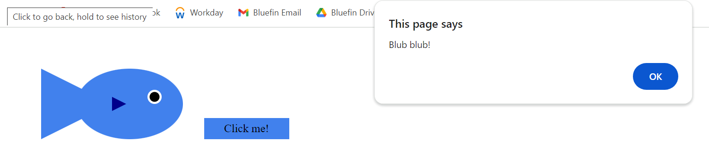

# D3.js SVG Elements Showcase


## Description

This repository showcases the usage of D3.js to create SVG elements dynamically. It includes functions to add rectangles, circles, lines, polygons, text, and more to an SVG container. The examples demonstrate how to interactively handle click events on SVG elements.

## Demo

Check out the live demo hosted on GitHub Pages: [D3.js SVG Elements Showcase](https://luke-bluefintech.github.io/a1-ghd3)

## Screenshots




## Technical and Design Achievements

- **Dynamic SVG Creation:** The code dynamically generates SVG elements using D3.js functions, allowing for flexibility in creating various shapes.
  
- **Click Event Handling:** Interactive click event handling is implemented for SVG elements, triggering `window.alert` messages upon clicking.

- **Responsive Design:** The SVG elements are designed to be responsive, adapting to different screen sizes.

- **Colorful Styling:** The elements are styled with vibrant colors, making the showcase visually appealing.

## Usage

1. Clone the repository:

   ```bash
   git clone https://github.com/luke-bluefintech/a1-ghd3.git
