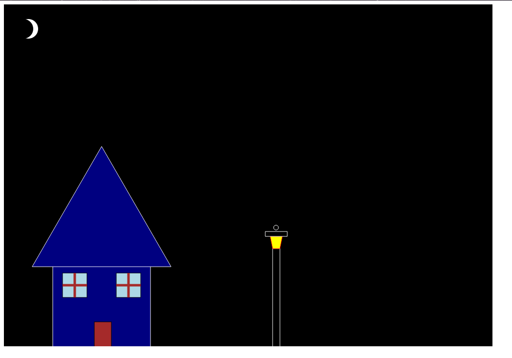
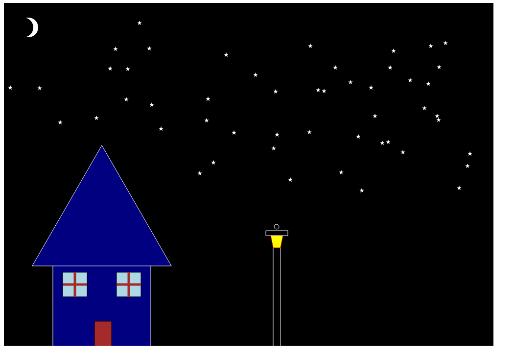

Assignment 1 - Hello World: GitHub and d3  
===
Name: Yu-Chi Liang
gh-page site: https://lyuchil.github.io/a1-ghd3/

## Project Description
This project is a simple visualization of a house at night with a street light outside using D3.js. You can interact with the visualization by clicking in th sky. Each click will generate a white star at the mouse location. 

## Screenshots

Visualization on the webpage

Star created by mouse clicks

## Requirements

I have used 4 graphics primitives, polygon(the light on top of the street light), rectangles(the house and windows), circles (the moon), lines (part of the window). Additionally, I have read about the usage of D3 symbols and used them in this project (the stars (star symbol) in the sky and the roof (triangle)). I have also incorporated different colors in the project.

## Technical Achivements

I decided to make the project more interactive than just showing an image. I added the feature that adds a star in the sky upon user click. This goes into understanding how the different events are handled within D3.js and how it tracks mouse movement. On top of that, I also limited the location where the star can be generated since it doesn't make sense if the star can be put on top of the house or on the ground.

## Design Achivements

I was able to create a recognizable image of a house, a street light and a nigth sky with stars using D3.js along with its documentations. I also used outlines to make the shapes not blend into the background. 

## Future Improvements

One thing that I think can be improved on this is to make the scenary more immersive, such as adding illumination effects around the stars or the street light. It would feel more realistic. The other thing would be adding more textures to the house. 

## References
1. Basic Setup and documentation of D3.js: https://d3js.org/getting-started
2. Event handling: https://d3js.org/d3-selection/events
3. Symbol usage: https://d3js.org/d3-shape/symbol
 