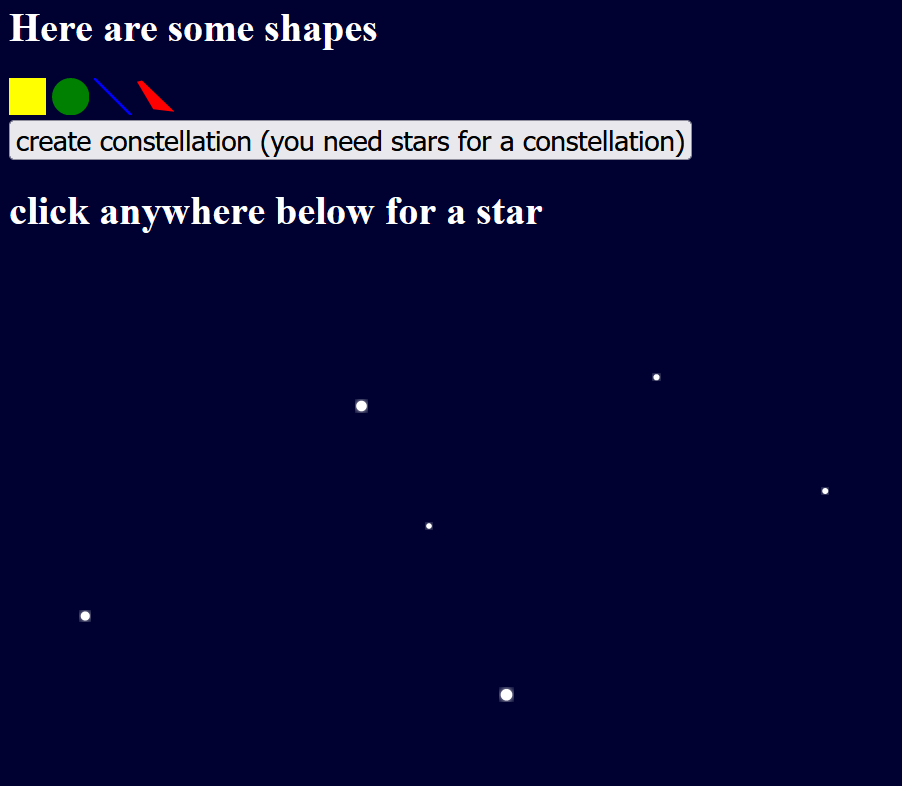
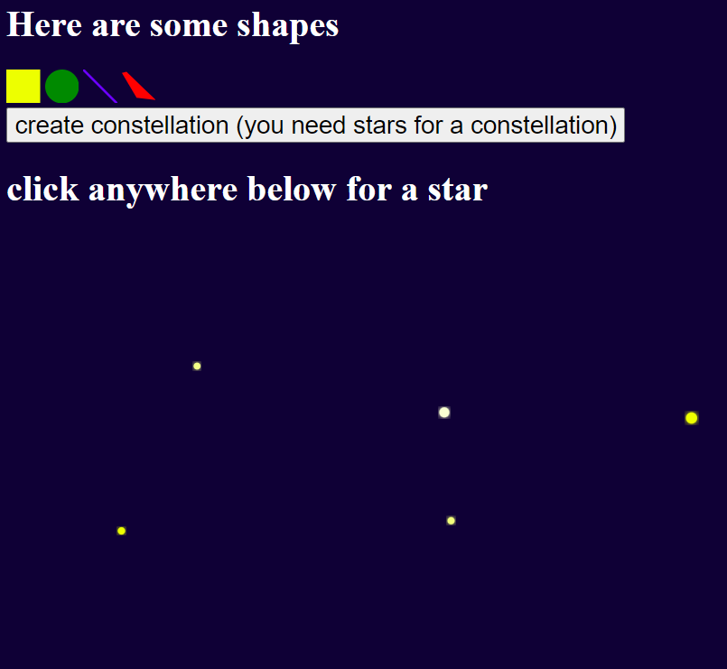
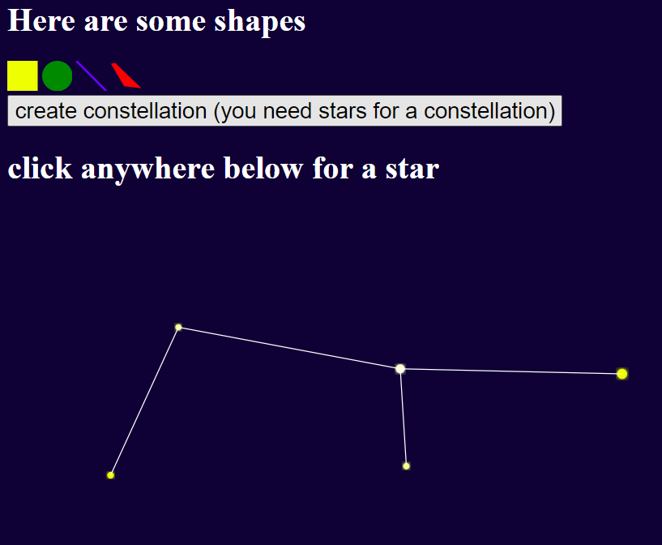

# Assignment 1 - Hello World: GitHub and d3  
===

[Live Link](https://aria-yan.github.io/a1-ghd3/)

## What I Did
At the top, you can see the rectangle (square), circle, line, and polygon I created with different colors using svgs.

## Technical and Design Achievement
Then, there is the ability to create 'stars' by clicking on the webpage. The size of the stars are randomly selected and so is the color from yellow to white. Then, by clicking the 'create constellation' button, white lines are drawn to connect the stars that were created. 

### No Stars

### Some Stars

### Constellation Created

## Sources
I used [this](https://www.visualcinnamon.com/2016/06/glow-filter-d3-visualization/) to add the glow effect to the stars and I used chatgpt to help me write functions to calculate the MST for the constellation effect. 
