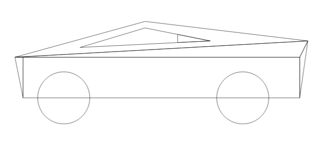
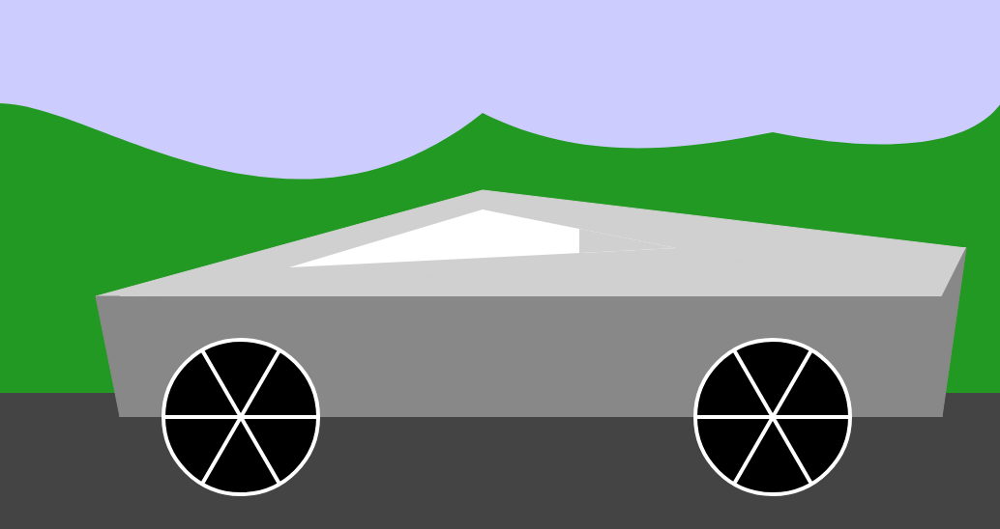

**1. Motivation:** 
    This project was an exploration in using basic geometric shapes to construct a recognizable object, specifically a cybertruck (easy choice). The design approach, using fundamental shapes such as triangles, rectangles, lines, circles, and paths, was influenced by creative ideas from thenounproject.com.

**2. Shapes Used to Create a Basic Rendering of Cybertruck and the Background:**

    a. Triangles:
        Quantity: 6 triangles.
        Details: These triangles vary in size and placement, forming the core structure of the truck. For instance, a large triangle (points1) forms the main body, while smaller ones (points3, points4) represent the front and rear ends of the truck.

    b. Rectangles:
        Quantity: 2 rectangles.
        Details: Rectangles are used to create the body, cargo area, and the base of the truck and background. 
    c. Circles:
        Quantity: 2 circles.
        Details: Representing the wheels, these circles (wheel1 and wheel2) are placed at the base of the truck. Lines are used to represent spokes (making rims was a little more challenging)
    d. Lines:
        Usage: Lines areused to form the spokes of the wheels (rims) with placement of these lines to create a realistic wheel effect.

    e. Paths:
        Application: A custom path (getHillPath) is used to create a hilly background, adding depth and context to the visualization. 

**3. Initial Design to Final Product:**

**4. Experimentation:**

    a. Transitions: The use of D3.js transitions effectively demonstrates the sequential assembly of the truck, highlighting each shape's contribution to the overall structure. This was also done as a simpler demo.

    b. Wheel Animation: The spinning wheel effect, achieved through rotating the spokes, adds a dynamic element. This involved researching techniques on forums like Stack Overflow to implement correctly.

    c. Background Creation: The hilly landscape in the background is inteded for better appeal.

**5. Future Improvements:**

    a. Animating Background: Learning how to animate the background to simulate the truck's motion through a landscape could be a significant enhancement.

    b. Interactivity: Incorporating interactive elements, like allowing viewers to change colors or shapes, could make the visualization more engaging.

**6. Technical Acheivement Description:**

    a. Composition of Cybertruck rendring using basic shapes demonstrating the understanding and use.

    b. Experimented with D3.js animations to rotate the wheels spokes. 

    c. Experimented with the transition of shapes as they are created that shows how the puzzle fits together. 

    d. Experimented with path to create the background hills to give some aesthetic look. 

**7. Design Acheivement Description:**

    a. Used the assignment guidelines and created a visually appealing rendering of cybertruck. 

    b. Use of colors and storkes that resembles the known color schemes of the cybertruc.

    c. Visual Storytelling of the rendering by animating in sequence. 

**8. References:**

    a. [http://d3js.org](http://d3js.org)

    b. [https://stackoverflow.com/questions/65979025/how-can-i-set-the-transform-origin-to-the-middle-of-this-rectangle-in-d3](https://stackoverflow.com/questions/65979025/how-can-i-set-the-transform-origin-to-the-middle-of-this-rectangle-in-d3)

    c. [https://thenounproject.com](https://thenounproject.com)

   