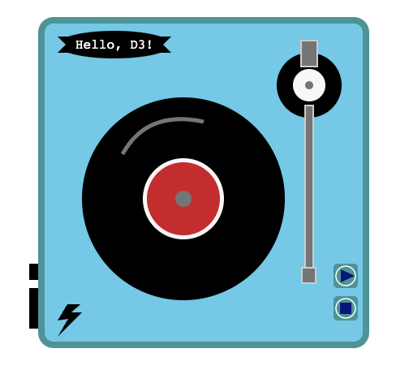
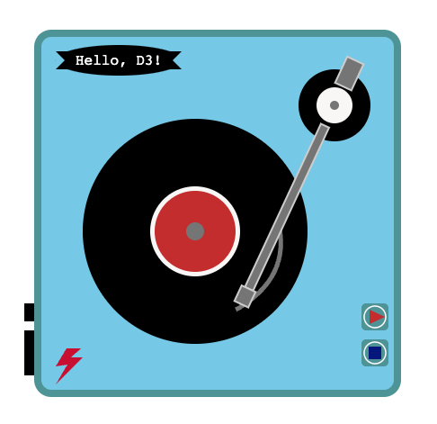
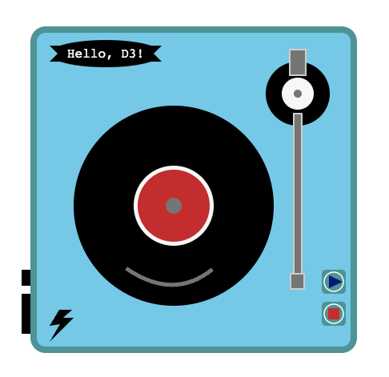

Assignment 1 - Hello World: GitHub and d3  
===
CS573 Data Visualization, Spring 2024

Jingni Cai

Link: https://jcai0o0.github.io/a1-ghd3/

In this project, I use d3.js to create a vinyl records player that allows users to play vinyl records virtually. Users can click the 'PLAY' button on the right side to move the tonearm up to the vinyl record. Vinyl record will start spinning and the lightning bolt on the left will continuously cycles through changing colors from blue to red, then red to blue, creating a dynamic visual effect. View can also click on the 'STOP' button, then tonearm will go back to its original position, vinyl will stop spinning, and the lightning bolt will stop changing colors. 

On the upper left of the turntable, we have the label of this turntable, proudly bearing the brand name 'Hello, D3!'.

Turntable is playing music

Turntable stops playing music

Requirements
---

1. **circles, ellipse**: vinyl record, brand label
2. **rectangles**: turntable, buttons, tonearm, headshell, etc
3. **lines**: a curved line that serves as an indicator of whether the vinyl is spinning or not
4. **path, polygon**: a lightning bolt, brand label
5. **colors** like red(#c43131), black, skyblue, darkblue, cadetblue, white, grey, lightgrey are used
6. **text**: brand name

Technical and Design Achievement
---
**Technical Achievements**:

* Implemented the 'PLAY' button functionality using the functions 'spin()' and 'changeColor()' that trigger various parts of the player upon clicking

* Utilized d3 functions like 'transition()', 'attrTween()', and 'd3.interpolateString()' to create smooth animations for the spinning vinyl and tonearm movement

* Employed 'd3.interpolateRgb()' for the continuous color change of the lightning bolt, ensuring a visually engaging effect through recursive function calls

* Incorporated dynamic color chanegs for the 'PLAY' and 'STOP' buttons, transitioning from dark blue to red upon clicking, employing the method "d3.select('class_name').attr('fill', 'color_name')"

* Implemented the stop functionality using '.interrupt()' method to stop the spinning vinyl and color-chaging lightning bolt.

* I tried two different ways to use color in d3.js, one is by using the color's name, and the other method is by passing in color hex code

**Design Achievements**:

* Crafted an interactive vinly records player using diverse primitive SVG shapes

* Added visually appearling animations, including color transitions for the 'PLAY' and 'STOP' buttons, continuous color-chaning lightning bolt, and rotating vinyl record and tonearm.

* Maintained a consistent visual theme by suing blue shades (skyblue, cadetblue, darkblue) as the primary color for the vinyl player

* Explored various style elements such as stroke, stroke-width, font-family, etc, contributing to the overall aesthetic appearl of the design.

Reference
---
some reference link that I looked:

* Prof. Harrison's intro video 
* [mdn svg tutorials](https://developer.mozilla.org/en-US/docs/Web/SVG/Tutorial/Paths)
* [d3 selecting elements](https://d3js.org/d3-selection/selecting)
* [stackoverflow how to interrupt ongoing transition](https://stackoverflow.com/questions/66016037/interrupting-d3-transition-how-to-interrupt-an-ongoing-transition-upon-drag)
* [d3 Tutorials](https://github.com/mbostock/d3/wiki/Tutorials)
