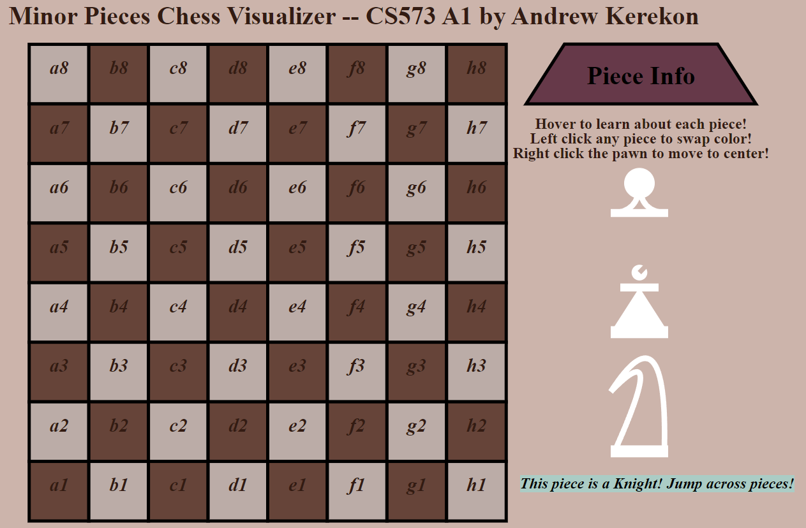

Assignment 1 - Hello World: GitHub and d3  
===
CS573, Spring 2024

Prof. Lane Harrison

Andrew Kerekon

Project Motivation and GitHub Pages Demo
---
As a chess player, I wanted to develop a way to visualize the minor pieces (pawn, bishop, and knight) in a way that helped me get familiar with the [d3.js](https://d3js.org/) library. Beyond developing shapes, I wanted to standardize scaling to display a chess board and pieces regardless of screen resolution. I also wanted to explore animations, transitions, movements, and text styling.

Source code for this project can be found here: https://github.com/akerekon/a1-ghd3

A live demo can be found here: https://akerekon.github.io/a1-ghd3/

Resources Consulted
---
- Prof. Harrison's overview video
- Overview: https://d3js.org/getting-started
- Specific Shapes: https://d3-graph-gallery.com/graph/shape.html
- Specific Shapes: https://developer.mozilla.org/en-US/docs/Web/SVG/Tutorial/Paths
- Polygons: https://stackoverflow.com/a/46138980 
- Text: https://jonathansoma.com/lede/storytelling/d3/text-elements/
- Lines: https://webdva.github.io/how-to-draw-a-line-in-d3js/
- Hover-Over: https://chartio.com/resources/tutorials/how-to-show-data-on-mouseover-in-d3js/
- Right-Click: https://stackoverflow.com/a/24660993

Project Requirements
===
- Circles are used with pawns and bishops
- Rectangles are used for the chess board
- Lines are used throughout, particularly for the base of all pieces
- Polygons are used for both the "Piece Info" heading as well as the bishop's middle
- 8 different colors are used, with compatibility verified using [Adobe's Color Wheel](https://color.adobe.com/create/color-wheel)

I referenced the above resources when writing code for this project and have linked to GitHub pages above.

Technical and Design Achievements
===
Technical Achievements:
- To explore d3.js's animation functionality, I added transitional movement that allows the pawn to move to the center of the board on right click
- To further explore these transitions, I utilized d3.js's click event to listen for a left click and change the color of each piece from white to black and vice-versa 
- To allow the user to learn more about each piece, I created hidden divs that appear when hovering over each piece so the user can learn more about their functionality
- The chess board is generated by a loop with a configurable board size that could be more than 8x8 if desired by the user, for a particular chess variant

Design Achievements:
- In addition to circles, rectangles, lines, and polygons, I explored quadratic paths in order to allow the curved lines on the pawn and knight
- To allow for better contrast, text is styled with colors and bold/italics
- All colors are selected from [Adobe's Color Wheel](https://color.adobe.com/create/color-wheel) to ensure proper balance
- The live demo passes Google Lighthouse's accessibility test at 100% for sufficient contrast ratio and proper documentation tags

