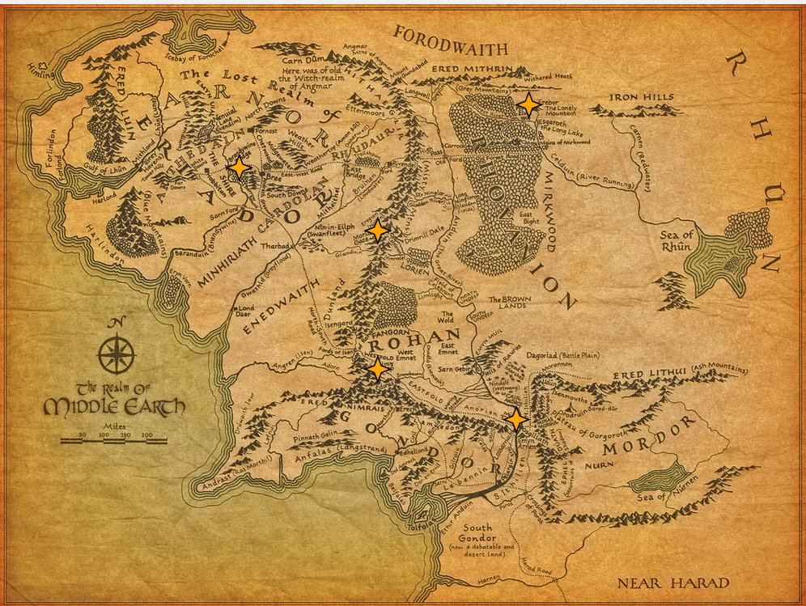
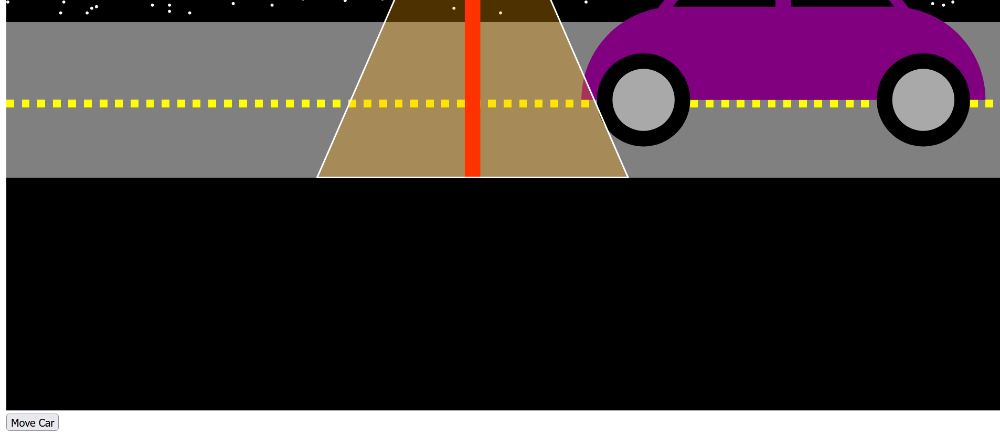

Data Visualization Assignment 1 - Hello World: GitHub and d3  
===
This assignment visualizes a simple interactive page called **"Friends Trip"**  in d3.js. The illustration includes the required shapes (circles, rectangles, lines, polygons, paths in different colors) to create animals, a train, and a background. You can also change the passengers to the other train by dragging. 

Demo Link: http://gbenderiya.github.io/a1-ghd3/index.html

Here is the screenshot of the page with default location of animals:

Here is the screenshot of the page after changing location of the animals:

Technical Achievement Desription
---
As an initial requirement of the task, I used SVG, D3.js and complex shapes ( Various complex shapes, including polygons, ellipses, and paths, are used to create the mountains, train, clouds, and animal faces.). Also, in order to give more vibrance I used the following methods: 
- Animation with CSS: The clouds and engine exhaust elements have dynamic movement achieved through CSS animations. 
- Interactive Elements using Drag-and-Drop Functionality: The passengers (fish, fox, mouse, bear) are implemented as interactive elements. They can be dragged across the SVG canvas, providing an engaging and interactive user experience.

The challenge:
- Animation CSS (create infinite moving object like path)
- Drag-and-Drop Functionality (to drag entire group of objects)

What helped me:
- I was lost in infinite moving objects and I solved it with the help of chatgpt. But to be honest, it still has a bug if you close look at the moving clouds.

Design Achievement Description
---
**The goal**: is to pay attention to detail, including features like windows in the train, facial features of animal passengers, and the arrangement of clouds, contributing to a polished and well-crafted scene.

What was done: 
- Aesthetic Layout: I tried to create an aesthetically pleasing layout with mountains, clouds, and a train, contributing to a visually engaging scene with color pallete and thematic elements. 

- For choosing colors,  I opted for vibrant colors for passengers,  and contrasting colors for train elements and shades of gray for mountains to enhance the overall visual appeal.

- In order to make it playful, I chose to  represent different animals (fish, fox, mouse, bear as passengers, cat as a conductor) for adding a thematic aspect to the design. I also used dynamic animations for  bringing a sense of movement and life to the scene, enhancing the overall user experience.

The biggest challenge:  (*for me*) was to figure out coordinates and make them aesthetic

What could I improve: beautify it based on the color combination, improve the movement functions, improve the conductor (the cat) - it was the first and worst of the others.