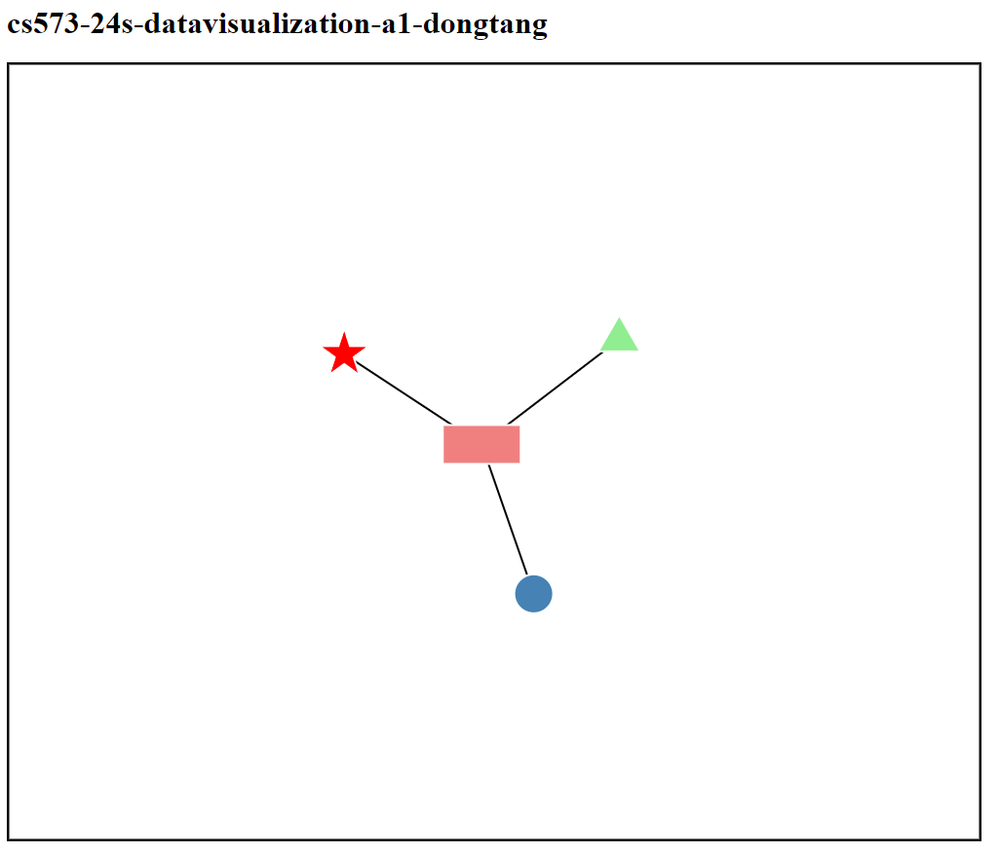
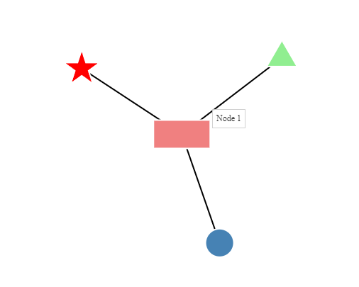
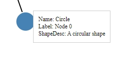

# Data Visualization Assignment 1

## Overview

This project demonstrates a simple data visualization using D3.js to create a force-directed graph. The visualization includes nodes of different shapes (circle, rectangle, triangle, and pentagram) connected by links. Additionally, nodes can be dragged.

## Screenshots

*Screenshot 1*

 
*Screenshot 2*

*Screenshot 3*
## Demo Site

Demo site: https://dongtang3.github.io/a1-ghd3

## Technical Achievement Desription

I successfully implemented a dynamic force-directed graph using D3.js. Key features include designing nodes representing different shapes (circle, rectangle, triangle, pentagram) with links connecting them. The relationships are defined through data structures.

Utilizing D3.js forces, I applied the forceLink for node links, the forceManyBody to simulate forces between nodes, and the forceCenter to center the graph within specified coordinates. Users can intuitively interact with the graph by dragging nodes, implemented through D3.js drag behaviors.

For a better user experience and visual clarity, I implemented responsive design and constraints.

## Design Achievement Description

The design prioritizes user interaction, ensuring a seamless and intuitive experience:

**Tooltip**: A tooltip is implemented to display information about nodes when hovered over. For example, Screenshot 2.

**Popup**: A popup appears when a user clicks on a node, presenting detailed information such as the node's name, label, and shape description. The timed disappearance of the popup after a few seconds. For example, Screenshot 3.

**Creating a border around graph**: Nodes are constrained within specified boundaries to prevent them from going beyond the canvas edges. 

