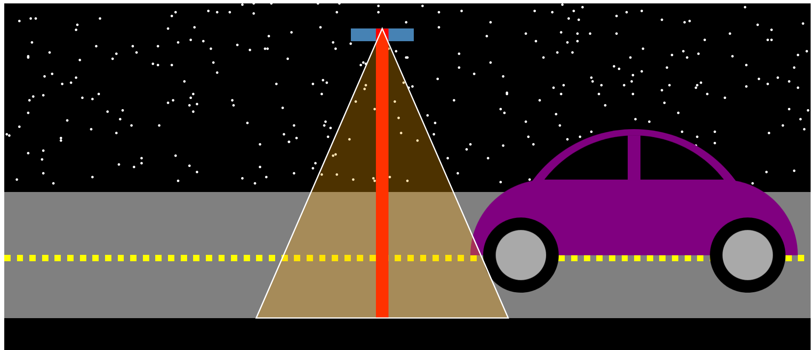

Assignment 1 - Hello World: GitHub and d3  
===
Link to gh-pages:

For this assignment, I created a graphic of a car on a street with a streetlight. I made the svg responsive to adjust to the page size. I made the car using circles, rectangles and an arcs, the street with rectangles and the streetlight using a rectangle and a line and a polygon for the light. I used various different colors and adjusted the opacity of the light to make it semi-transparent. I made the road using a for loop to repeat the pattern for the dashed lines. 

Technical Achievement Description:
My technical achievement includes using d3's transition to make the car move across the screen when a button on the bottom is pressed. I grouped the background, car and foreground accordingly, then used the transition function on the car group to get it to move.

Design Achievement Description:
I used code to generate some repeating patterns. For the stars, the positions were generated randomly, then appended to the background. I also tried to make the car and environment look nice.

