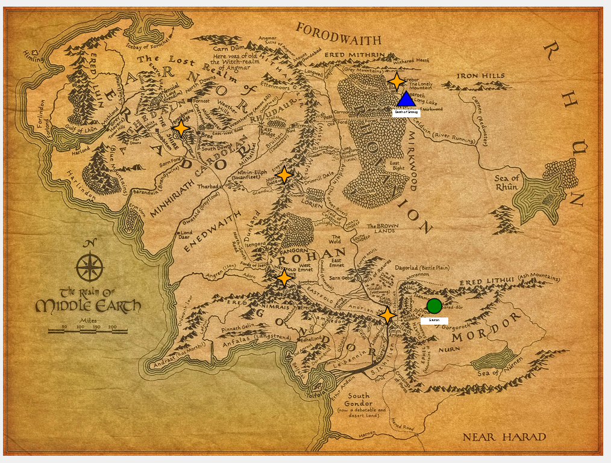
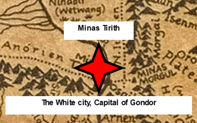

Assignment 1 - Hello World: GitHub and d3  
===

This project is an interactive map of Lord of the Rings. You can zoom and pan over the map, and when you click on one of the interactive stars on the map, the map zooms into that star and informative text appears. You can click the map to return to full view, and you can click on the same star you are on and it will return to full view.

Requirements
---

Used 4 graphics primitives: polygon (4 pointed star), text, image, rectangle. 4+ colors are used.

Source: https://observablehq.com/@d3/zoom-to-bounding-box?intent=fork

The idea of this project is entirely taken from this map, and at first a lot of the code was used. But there are major alterations from the source material. First, I was no longer able to rely on the US mapping code support so that invalidated a lot of code right away. But I mainly chose this one because I was frustrated with its failings as a design.

design flaws:
-after clicking on a state, you had to pan to find a non-state area to click and reset to the full map.
-dragging has no limits, can drag as far as you like into the void
-after zooming in, if you moved your cursor sideways and zoomed out, the FOV would be in one of the oceans. (This was the most frustrating)

As I fixed all of these issues, I believe I have fullfilled the requirements of making my project unique from its source.

Technical Acheivement
---

I think fixing the issues of the prior design qualifies me for some technical acheivements, as it goes beyond what was expected. In addition to that, I also implemented a system that allows the adding of one point with a single line of code, which is something that could easily be moved into some kind of gui. The image could also be swapped out without too much trouble. In essence, I've created a modular map-making tool for marking important locations, which I think qualifies me for the rest of the points.

Design Acheivement
---

In the design category, I would say that recognizing they are a problem at all is at least partially a design acheivement. if UIs are frustrating, unintuitive, and not easily navigable, the information trying to be portrayed is lost on the viewer. I think my design merged the best of what my source had to offer with my own changes. Some other seemingly minor, yet important things, I made it so that the screen scales with how much space the browser gives it, meaning it can be as large and as small as needed (also this requires a page reload). I also think that my decision to keep the titles hidden until clicking on the point is a good balance of what to display and what not to display, it requires the user to click and interact with the map, which I think is the intent of this product. All in all, I think the summation of what I have done earns me the design acheivement.