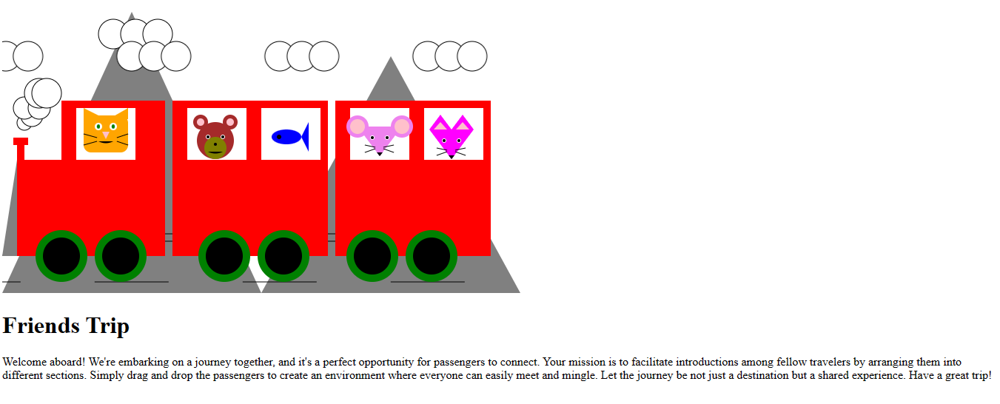

Data Visualization Assignment 1 - Hello World: GitHub and d3  
===
This assignment visualizes a simple interactive page called **"Friends Trip"**  in d3.js. The illustration includes the required shapes (circles, rectangles, lines, polygons, paths in different colors) to create animals, a train, and a background. You can also change the passengers to the other train by dragging. 

Demo Link: https://gbenderiya.github.io/a1-ghd3/index.html

Here is the screenshot of the page with default location of animals:


Here is the screenshot of the page after changing location of the animals:




Technical Achievement Desription
---
- Fork the GitHub Repository for Assignment 1. You now have a copy associated with your username.
- 

Design Achievement Description
---
- To submit, make a [Pull Request](https://help.github.com/articles/using-pull-requests/) on the original repository.
- Note: name your pull request using the following scheme: 
```
a1-your Gh username-your first name-your lastname

```


Grading
---

Grades are on a 120 point scale. 
96 points will be graded for functionality: the program does what the assignment requests with an informative README. 

We will use Google Chrome to view submissions. 
Be sure to test your code there.

Below are some, but not necessarily all, of the key points we will consider during grading:

- Circles and Rectangles  
- Lines  
- Paths  
- Different colors  
- README Quality
    - A description of what you have created. 1-2 screenshots are recommended for the README.  
    - A working link to the hosted files (usually the gh-pages 'live' url)  
    - Section for Technical and Design Achievements


